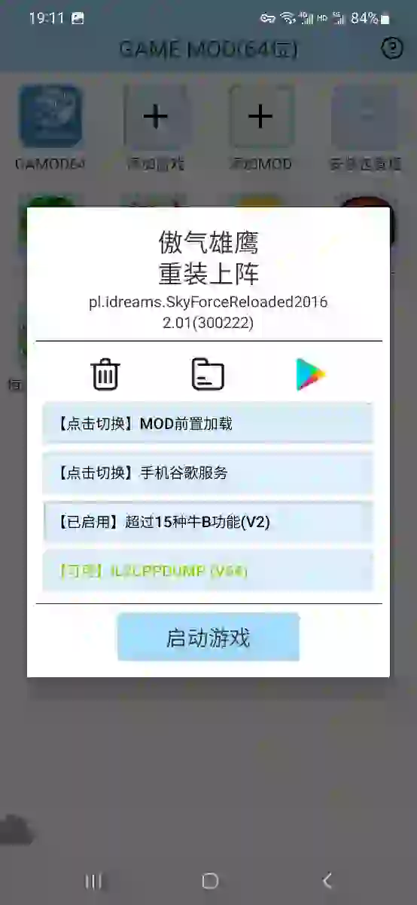

README
===========================

# GM == GAMOD == GameMod == GodMode（上帝模式） == GG的MM（纪念GG助手君）

* 免ROOT的安卓双开应用，专为双开游戏加载MOD而生，最高支持安卓13

* 除存储权限外，所有其它权限均为双开应用使用，本App不要，也建议不要授权，除非双开的某游戏必需要特定权限。本应用不含任何第三方SDK，没有数据统计，没有广告，没有任何你能想到和想不到的坑，只是一款单纯的单机工具软件

* 本应用部分模块代码搬运自GG大玩家，谢谢好心人提供^_^。大部分MOD代码由原作者提供，不全是因为还要联系作者授权代码或者作者自己都找不到代码了。GG大玩家的MOD以32位版本为主，作者尽量都调整为64位版本。

* 在GAMOD中所有MOD的功能全部免费使用。**有人问这些MOD能在GG大玩家上用不？GAMOD用的GG的框架改的，所以MOD当然是兼容的！只是需要一点小技巧：例如植物大战僵尸2，从GG导入游戏后，设置选择64位启动，mod文件放在存储卡的/ggtest/plugin/开发目录下，启动游戏就能看到mod了，因为没有GG的服务器配置，功能无法打赏启用，但是GG会员可以无条件直接使用任意MOD功能**

* 作者本人主力机型为安卓13的三星手机，不保证国内魔改安卓的小米、Oppo、Vivo、华为的兼容性，有问题提issue，不保证解决（就算赞助手机也不保证解决^_^）

****

# GAMOD64支持的64位MOD

	apkpure.com是作者下载游戏的主要来源，这儿提供的是官方原版安装包，没有乱七八糟的改版。但是没有付费游戏的下载😓
	付费游戏作者暂时用apkaward.com的安装包，这里的包是改版包，启动会弹Toast很🤢，大家有好的下载建议请留言
	以下表格中，点击游戏名跳转到apkpure的游戏下载详情页，请注意下载页显示的架构，下载64位游戏安装包

- 含有 **arm64-v8a** 的，表示该游戏支持 **64** 位；
	以下表格中的游戏，MOD在工程里自己下载。游戏说明里有 **【中文】** 标签，表示启动中文或设置里可以调为中文显示；有 **【GP】** 标签，说明来自GooglePlay，没有中国境内的实名要求，打开就玩。

|游戏|支持版本|说明|
| --------- | --------| --------|
| [植物大战僵尸2【国际版】](https://apkpure.com/cn/plants-vs-zombies%E2%84%A2-2/com.ea.game.pvz2_na/download "下载跳转") | 2023年10月 10.8.1|【英文】【GP】没时间肝200多种植物，就开MOD完美全收集吧|
| [梦幻花园](https://apkpure.com/cn/gardenscapes/com.playrix.gardenscapes/download "下载跳转") | 2023年10月 7.3.5|【中文】【GP】休闲游戏也能刷榜|
| [骷髅女孩](https://apkpure.com/cn/skullgirls-fighting-rpg/com.autumn.skullgirls/download "下载跳转") | 2023年10月 6.0.1|【中文】【GP】开MOD暴打对手，建议仅单机用，联机被举报就属于No Zuo No Die|
| [火星幸存者火星归来](https://apkpure.com/cn/mars-survivors/com.mars.leguas.a/download "下载跳转") | 2023年10月 1.4.2|【中文】【GP】比吸血鬼幸存者轻量化，玩起来不累，开MOD割草解压|
| [糖果粉碎传奇](https://apkpure.com/cn/candy-crush-saga/com.king.candycrushsaga "下载跳转") | 2023年10月 1.263.1.1|【英文】【GP】老游戏了，不值得氪金，用MOD随便玩玩吧|
| [貓咪大戰爭](https://apkpure.com/cn/%E8%B2%93%E5%92%AA%E5%A4%A7%E6%88%B0%E7%88%AD/jp.co.ponos.battlecatstw/download "下载跳转") | 2023年09月 12.6.1|【中文】【GP】池子里几百个角色要抽，没钱就MOD开路好了|
| [植物大战僵尸2【中国版】](http://game.talkweb.com.cn/ "下载跳转") | 2023年09月 3.2.0|【中文】手机号注册即可玩，开MOD单机刷图刷钱就行，联机被举报属于No Zuo No Die|
| [异星指令](https://apkpure.com/cn/xeno-command/com.chillyroom.xenocmd/download "下载跳转") | 2023年09月 1.3.10|【中文】【GP】没元气、战魂好玩，开MOD快速通关就好了|
| [战魂铭人【GP版】](https://apkpure.com/cn/otherworld-legends/com.chillyroom.zhmr.gp/download "下载跳转") | 2023年09月 1.18.5|【中文】【GP】中国版与GP版游戏包名不一样，所以此MOD不能在中国版运行|
| [元气骑士【GP版】](https://apkpure.com/cn/soul-knight/com.ChillyRoom.DungeonShooter/download "下载跳转") | 2023年09月 5.4.5|【中文】【GP】中国版与GP版游戏包名一样，MOD也许能正常支持中国版|
| [梦幻家园](https://apkpure.com/cn/homescapes-android/com.playrix.homescapes/download "下载跳转") | 2023年09月 6.5.2|【中文】【GP】后期不氪金玩的很累，用MOD放松一下吧|
| [吸血鬼幸存者](https://apkpure.com/cn/vampire-survivors/com.poncle.vampiresurvivors/download "下载跳转") | 2023年08月 1.6.108|【中文】【GP】开MOD割草解压|
| [傲气雄鹰重装上阵](https://apkpure.com/cn/sky-force-reloaded/pl.idreams.SkyForceReloaded2016/download "下载跳转") | 2023年03月 2.01|【英文】【GP】经典STG，用MOD开无双爽爆|
| [恶魔城月下夜想曲](https://apkaward.com/castlevania-symphony-of-the-night "下载跳转") | 2022年08月 1.0.2| 【英文】【GP】官方移植，触控优化，怀旧的话不用MOD估计就没人玩了|

# GAMOD32支持的32位MOD

	apkpure.com是作者下载游戏的主要来源，这儿提供的是官方原版安装包，没有乱七八糟的改版。但是没有付费游戏的下载😓
	付费游戏作者暂时用apkaward.com的安装包，这里的包是改版包，启动会弹Toast很🤢，大家有好的下载建议请留言
	以下表格中，点击游戏名会跳转到apkpure的游戏下载详情页，请注意下载页显示的架构，下载32位游戏安装包

- 含有 **armeabi-v7a** 的，表示该游戏支持 **32** 位

|游戏|支持版本|说明|
| --------- | --------| --------|
| [植物大战僵尸1【国际版】](https://apkpure.com/cn/plants-vs-zombies/com.ea.game.pvzfree_row/download "下载跳转") | 2023年08月 3.4.3|【英文】【GP】开MOD完成100%完成度，童年完美了|
| [植物大战僵尸2【国际版】](https://apkpure.com/cn/plants-vs-zombies%E2%84%A2-2/com.ea.game.pvz2_na/download "下载跳转") | 2023年10月 10.8.1|建议玩64位版本，性能比32位版本要好，MOD功能是一样的|
| 恶魔城月下夜想曲 | 1.0.0| 游戏链接找不到了，玩64位的1.0.2版本吧|

**** 

# 使用说明

## **添加游戏** 
- 游戏早已装好，启动GAMOD后，选择 **添加游戏**，自动列出所有支持的已安装应用，选择你想要的应用，点击一下即可导入GAMOD沙盒

## **安装包管理** 
- 在Download目录下放着下载好的.apk或.xapk文件，启动GAMOD选择 **安装包管理**，自动列出所有支持的安装包文件，点击你想要的，选择安装后会自动导入GAMOD沙盒

## **添加MOD** 
- 在Download目录下放着下载好的.mod文件，启动GAMOD选择 **添加MOD**，自动列出所有支持的mod文件，点击你想要的，可选择导入mod或告知mod使用条件

## **游戏启动** 

### **【点击切换】MOD前置加载/MOD后置加载** 
- 不建议变更，一般仅开发时可能会用到后置加载方式

### **【点击切换】手机谷歌服务/屏蔽谷歌服务/虚拟谷歌服务**
- 建议游戏启动闪退时，挨个切换试一遍，也许就正常了

### **【已启用】xxxx /【已禁用】xxxx **
- MOD启用与禁用，能正常玩就不要动
- 长按可以选择删除mod

### **【可用】xxxx **
- 从Download里自动匹配到可用的MOD，点击一下会自动安装入游戏，变成 **【已启用】** 状态，
- **请注意** ：多mod的支持暂不完善，当一款游戏有多个mod时，请一次只启用一个防止异常

### 左上图标 **移出沙盒**
- 从GAMOD沙盒中移除游戏，本地数据会全部清空，存档清空，建议移除前备份存档数据

### 中间图标 **文件管理**
- 可以浏览管理游戏在沙盒中的文件，备份存档或还原存档或清空数据
- 对于文件与目录可以长按选择删除

### 右侧图标 **GMS**
- 当前GMS谷歌框架在沙盒中的状态，点击可以操作，但主要给作者开发测试用的，普通用户最好不要动

# 版本区别

| 版本 |  说明 |
| --------- | --------|
| 64位  |  包名mod.loader.armv8a，仅支持64位类型游戏与MOD，绝大多数游戏也都支持64位 |
| 32位  |  包名mod.loader.armv7a，仅支持32位类型游戏与MOD，很多老的经典游戏，只有32位版本 |

****

# 用户区别

| 用户设备 |  说明 |
| --------- | --------|
| 普通用户 | 给同学玩的，无联网操作，纯本地化应用，听同学建议，开游戏就开MOD会导致游戏乐趣受损体验不全，所以进游戏后要等几分钟，过新手教程熟悉游戏玩法后再启用功能  |
| 测试用户 | 会联网Github，读取本工程项目下的upgrade.json（客户端升级配置），mods.json（MOD提交数据）  |
| 开发用户 | 作者本人用，可以授权普通用户设备为测试用户，方便作者的多台设备同步MOD |

****

# 提交Issue

* 申请测试用户，请提交issue申请，并附上申请设备的androidid。
* MOD需求，请提交issue申请，新游戏的话，请额外附加游戏下载链接+游戏包名，方便作者下载游戏。
* 作者仅提供单机游戏MOD（可断网玩的类型），网游类游戏请不要提，提了也没人理
